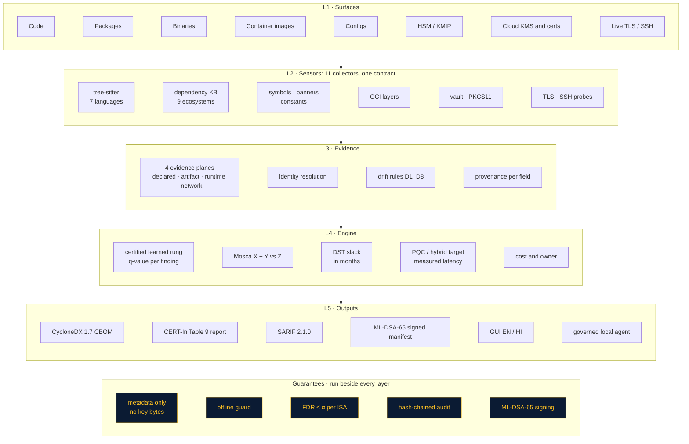
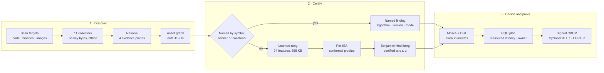
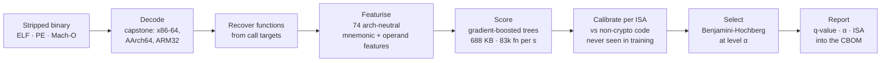
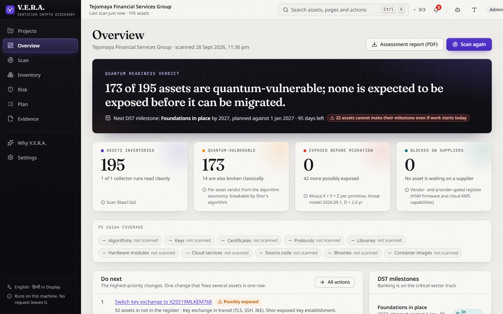
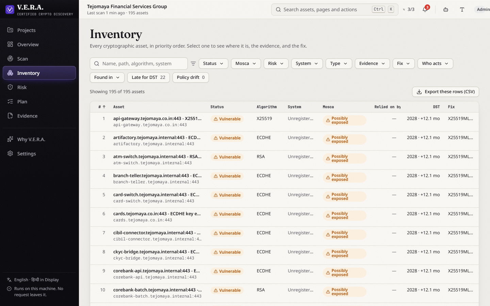
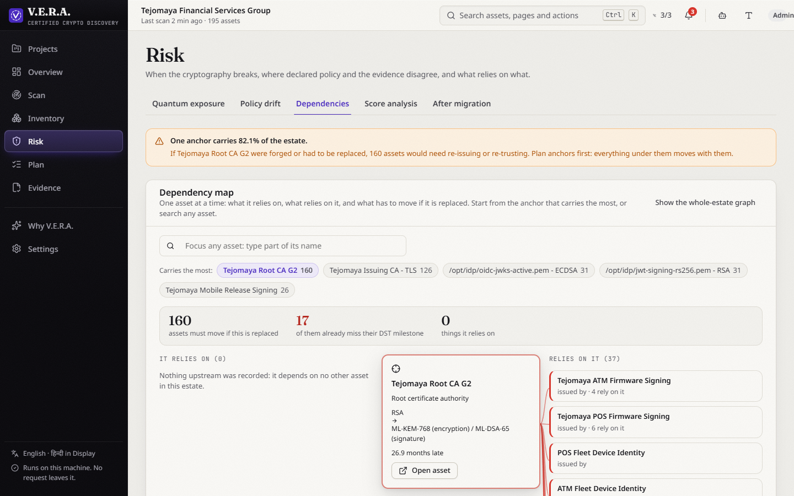
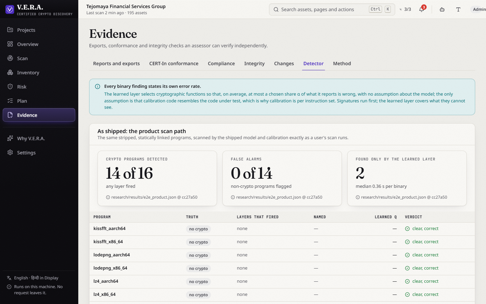
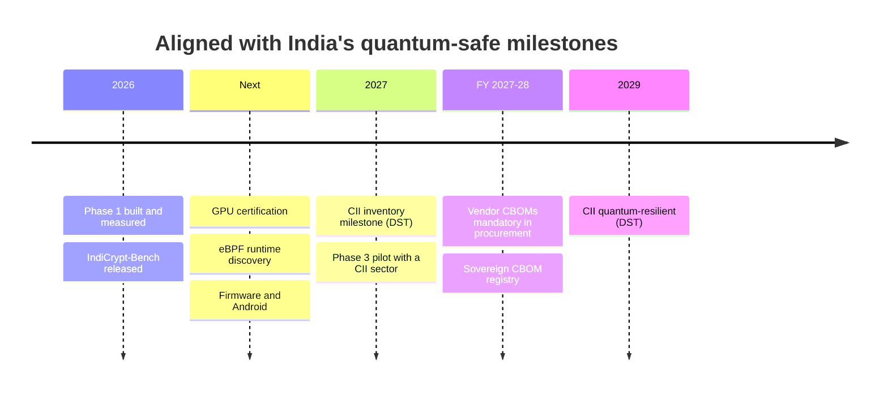

# V.E.R.A. — Verified Enumeration of Risky Algorithms

## Install

Not on PyPI yet; a PyPI release is planned and the licence is to be announced. For now, install from the repository:

```bash
pip install "vera-cbom @ git+https://github.com/dhruva137/V.E.R.A.git"                 # engine + CLI (`vera`)
pip install "vera-cbom[server] @ git+https://github.com/dhruva137/V.E.R.A.git"       # + uvicorn, to run the API server (`vera serve`)
pip install "vera-cbom[mcp] @ git+https://github.com/dhruva137/V.E.R.A.git"          # + MCP adapter
pip install "vera-cbom[all] @ git+https://github.com/dhruva137/V.E.R.A.git"          # everything above
```

Quick start (Python 3.11+):

```bash
pip install "vera-cbom @ git+https://github.com/dhruva137/V.E.R.A.git"
vera scan --source ./my-project --binary ./build/app -o cbom.json
vera version
```

`vera serve` starts the API and OpenAPI docs on `http://127.0.0.1:8000/docs` (needs the `server` extra).
Writable state lives under `~/.vera` (override with `VERA_HOME`).

Part of Paper To Anything (https://papertoanything.com) — research software developed and maintained by Dhruva P Gowda. In development.

**Certified cryptographic discovery for the quantum-safe transition.**

V.E.R.A. finds every cryptographic asset an organisation runs — in source code, packages, compiled binaries,
container images, configurations, keystores, HSMs, key managers, cloud key services and live TLS/SSH — including
inside **stripped binaries with no source and no symbols**. Every finding from compiled code carries a
**q-value: a proven bound on how often such findings are wrong**. That bound travels into a CycloneDX 1.7 CBOM that
is checked against CERT-In's Table 9 and signed with the post-quantum signature ML-DSA-65.

**Offline by default · metadata only (no key material is ever read or stored) · every number carries its source.**

| | |
|---|---|
| Benchmark | [**IndiCrypt-Bench**](https://github.com/dhruva137/indicrypt-bench): 30 libraries, 4 toolchains, 128,288 labelled functions, 8 sealed crypto libraries |
| Tests | **952 passing**, 2 skipped (`cd backend && python -m pytest -q`) |
| API | **144 routes** (FastAPI, OpenAPI at `/docs`) |
| Detector | 688 KB model, **83,466 functions/s on a CPU**, x86-64 · AArch64 · ARM32 |

---

## Contents

- [Why certified discovery](#why-certified-discovery)
- [Architecture](#architecture)
- [The certified detector](#the-certified-detector)
- [Capability coverage](#capability-coverage)
- [Measured results](#measured-results)
- [Run it](#run-it)
- [The interface](#the-interface)
- [IndiCrypt-Bench](#indicrypt-bench)
- [Guarantees and how they are checked](#guarantees-and-how-they-are-checked)
- [Use it in CI (SARIF)](#use-it-in-ci-sarif)
- [Roadmap](#roadmap)
- [Repository layout](#repository-layout)
- [References](#references)

---

## Why certified discovery

India's migration to post-quantum cryptography has a fixed clock. The DST Task Force report
([*Implementation of Quantum Safe Ecosystem in India*, 4 Feb 2026](https://dst.gov.in/sites/default/files/Report_TaskForce_PQMigration_4Feb26%20(v1).pdf))
asks Critical Information Infrastructure to finish its cryptographic inventory by **2027**, makes vendor CBOMs
mandatory in procurement from **FY 2027–28**, and targets quantum-resilient CII by **2029**. CERT-In's
[CBOM guidelines v2.0](https://www.cert-in.org.in/PDF/TechnicalGuidelines-on-SBOM,QBOM&CBOM,AIBOM_and_HBOM_ver2.0.pdf)
(Table 9) fix what each record must contain. RSA-2048 is now estimated breakable with under one million noisy
qubits in under a week ([Gidney, 2025](https://arxiv.org/abs/2505.15917)).

Every migration starts with discovery, and discovery has to be trustworthy. Tools report every hit as certain, but
in real binaries crypto is rare, and a fixed confidence threshold collapses:

| Crypto share of functions | Fixed 0.9 cut-off: false findings | V.E.R.A., conformal α = 0.1: false findings |
|---|---|---|
| natural (34%) | 14.5% | **6.7%** |
| 5% | 60.8% | **8.0%** |
| 1% | 89.5% | **3.7%** |

Measured on libraries never seen in training ([`research/results/v1_1_detector.json`](research/results/v1_1_detector.json)).

---

## Architecture

Five layers. Data flows down; guarantees run beside every layer.



### End-to-end flow



---

## The certified detector



For function *j* with score *s<sub>j</sub>* and *n* calibration scores *s<sub>i</sub>* from known non-crypto
functions of the same instruction set:

```math
p_j = \frac{1 + \#\{\, i : s_i \ge s_j \,\}}{n + 1}
```

**Proposition 1** ([`research/THEORY.md`](research/THEORY.md)). Under within-ISA exchangeability, Benjamini-Hochberg
on these per-ISA (Mondrian) conformal p-values controls the false-discovery rate:

```math
\mathrm{FDR} \le \alpha \cdot \frac{m_0}{m} \le \alpha
```

**Proposition 3** gives the exact calibration floor: certifying anything in an *m*-function binary at level α needs
at least *m/α − 1* calibration functions for that ISA. **Theorems 2a and 2b** prove two ways to fuse several
evidence rungs without losing the guarantee. All four are checked in simulation: 26 settings × 2,000 runs,
0 violations ([`theory_sim.json`](research/results/theory_sim.json)).

In plain words: each function is ranked against thousands of known non-crypto functions; only clear outliers are
reported, and the maths caps false alarms at the level you choose — with no trust placed in the model.

Every learned finding carries machine-readable CycloneDX properties: `vera:detection-method`,
`vera:detection-q-value`, `vera:detection-alpha`, `vera:detection-isa` and `vera:functions-selected`.

---

## Capability coverage

| Capability | V.E.R.A. |
|---|---|
| Discover cryptography across applications, libraries, binaries, containers, configurations, certificates, keys and protocols | **11 collectors**: source code in 7 languages (tree-sitter), dependencies in 9 ecosystems, binaries (ELF, PE, Mach-O, JAR), container images (layer-aware), configuration (nginx, Apache, HAProxy, OpenSSH, OpenSSL, strongSwan, Java, Terraform), keystores and certificates, HSM (PKCS#11) / KMIP / cloud KMS and certificate services (AWS, Azure, GCP), live TLS and SSH plus recorded captures |
| Inventory classified by type, lifetime and business criticality | Identity resolution across collectors, so one key seen in a keystore, an HSM and a handshake is one asset. An estate register declares systems, exposure, criticality and data classes; X (data lifetime) comes from the data classes. Drift rules D1–D8 flag where declared policy and evidence disagree |
| Quantum risk assessment | Mosca's inequality per asset with a **per-primitive CRQC horizon** (GRI Quantum Threat Timeline 2026, shifted by each primitive's published logical-qubit estimate); harvest-now-decrypt-later and forge-later exposure; slack in months against the DST milestones |
| PQC or hybrid recommendations by risk, latency and cost | Targets per asset for NIST (FIPS 203/204/205) and CNSA 2.0 profiles, hybrid first where the peer may be classical; latency measured on the host; who can fix it (team, HSM vendor, cloud provider); procurement clause drafts for gated suppliers |
| Deliverables | CycloneDX **1.7** (and 1.6) CBOM with versions and modes, **SARIF 2.1.0**, PDF report, **ML-DSA-65-signed** evidence manifest, hash-chained audit log, bilingual GUI |

The full table with the test that covers each row: [`docs/PS_COVERAGE.md`](docs/PS_COVERAGE.md).

---

## Measured results

Every figure comes from the file named next to it; re-run the command to reproduce it.

### Certified detection in stripped binaries

| Result | Value | Source |
|---|---|---|
| Shipped model, end to end through the product scan path | **14/16** stripped crypto programs found, **0/14** false alarms, 2 found only by the learned rung, **0.36 s** median per binary | [`e2e_product.json`](research/results/e2e_product.json) |
| ROC-AUC on libraries never seen in training | **0.826** (x86-64 0.834, AArch64 0.805, ARM32 0.831); 0.820 pooled over 8 sealed crypto libraries | [`v1_1_detector.json`](research/results/v1_1_detector.json), [`self_audit.json`](research/results/self_audit.json) |
| Per-ISA calibration | ARM32 false share 35.6% → **3.9%**; cross-ISA study 1.2% (AArch64), 1.9% (ARM32) | [`v1_1_detector.json`](research/results/v1_1_detector.json), [`v2_cross_isa.json`](research/results/v2_cross_isa.json) |
| Unseen optimisation levels | ROC-AUC **0.856** (O3), **0.845** (Os) | [`v2_scale.json`](research/results/v2_scale.json) |
| Robustness: dead code (10%, 30%), instruction substitution, blinded constants | AUC change **≤ 0.025**; measured FDR ≤ 0.9% | [`v2_robustness.json`](research/results/v2_robustness.json) |
| Guarantee under library shift | FDR ≤ **1.5%** in all 6 library-disjoint cells | [`self_audit.json`](research/results/self_audit.json) |
| Against Findcrypt3 | V.E.R.A. finds **8 programs signatures cannot** (ML-KEM, ML-DSA, SipHash, micro-ecc, each on two ISAs) | [`research/SELF_AUDIT.md`](research/SELF_AUDIT.md) |
| Runtime cost | 688 KB model, 83,466 functions/s, trained in 9.9 s, no GPU | [`v1_cpu_cost.json`](research/results/v1_cpu_cost.json) |

### Real container images from Docker Hub

Pulled without a Docker daemon, every blob SHA-256-verified against its digest, scanned through the product's own
HTTP API ([`research/e2e/container_e2e.py`](research/e2e/container_e2e.py) → [`container_e2e.json`](research/results/container_e2e.json)):

| Image | Assets | Highlights |
|---|---|---|
| `nginx:1.27-alpine` | **38** | AES-128/256 in GCM, CBC, CTR, CCM; ChaCha20; DH; ECDSA; RSA; OpenSSL 3.3.3 resolved; modes on 20/20 AES components; **CERT-In Table 9: 96.2%**; CycloneDX 1.7 valid, 0 violations |
| `alpine:3.20` | 8 | OpenSSL 3.3.7 resolved; valid, 0 violations |

### Post-quantum cost on this host

`python bench/pqc_bench.py` → [`bench/pqc_bench.json`](bench/pqc_bench.json), OpenSSL 3.5.4:

| Operation | µs |
|---|---|
| ML-KEM-768 keygen / encaps / decaps | 50.2 / **31.2** / 49.1 |
| X25519 derive | **50.3** |
| ML-DSA-65 sign / verify | 1,555 / 300 |
| ECDSA P-256 sign / verify | 32.5 / 92.2 |
| RSA-2048 sign / verify | 375 / 27.0 |
| SLH-DSA-SHA2-128s sign | 456,902 |

Post-quantum key exchange is as fast as the classical one it replaces.

### Source-level detection

`python bench/make_corpus.py && python bench/score.py` → [`bench/results.json`](bench/results.json). 85 labelled
cases across 7 languages plus dependency, config, SSH, binary and container cases, including decoys; 30% held out
by hash.

| Split | Precision | Recall | F1 | Cases |
|---|---|---|---|---|
| Tune | 0.982 | 0.949 | 0.966 | 58 |
| Held out, first run | 0.889 | 0.889 | 0.889 | 27 |
| Held out, after two disclosed benchmark corrections | 0.964 | 1.000 | 0.982 | 27 |

Both corrections are recorded in `bench/results.json` → `corrections_after_first_run`; no detection rule was
changed after the held-out results were seen. Floors are pinned in `backend/tests/test_bench_floors.py`.

### Governed agent

`python bench/agent_bench.py` → [`bench/agent_results.json`](bench/agent_results.json): 30 labelled prompts × 3
repeats on local qwen3:1.7b.

| Arm | First-decision accuracy | Median time to select a tool |
|---|---|---|
| Model alone | 47.8% | 1,476 ms |
| Deterministic router + model | **87.8%** | **14 ms** |

### Demo estate: Tejomaya Bank (synthetic)

`demo/estate` — a synthetic bank with nine systems. The full scan produces 229 findings that resolve to
**219 assets**: **138 quantum-vulnerable**, **52 exposed before they can be migrated**, and **17 that cannot meet
their DST milestone even if work starts today**. The 142 recommended changes come to **609 person-days = Rs 1.10
crore** at the bank's declared day rate (Rs 18,000, in the estate register); per-need effort figures are stated
planning assumptions (`backend/engine/cost_model.py`).

---

## Run it

```bash
cd backend && pip install -r requirements.txt && python main.py      # http://localhost:8000/docs
cd frontend && npm install && npm run dev                            # http://localhost:5173
ollama pull qwen3:1.7b                                               # local agent model (optional)
```

`python main.py` starts in a restricted, offline mode unless you set these yourself: `VERA_AGENT_MODE=read_only`,
`VERA_LLM_PROVIDER=ollama`, `VERA_LLM_MODEL=qwen3:1.7b`, `VERA_LLM_THINKING=0`, `VERA_OFFLINE=1`. The offline
guard allows only this machine and scan targets an operator names. Settings → Runtime shows what is in force.

**Sign-in is on.** The first time the dashboard opens it asks this machine to create the first admin. Passwords are
scrypt-hashed locally and every sign-in is written to the audit chain. `VERA_AUTH=0` turns sign-in off for a
single-user bench; `python -m engine.auth reset-password NAME` (from `backend/`) recovers an account.

To see a full estate, open **Scan** and click **Run scan**: the bundled register (`demo/estate/estate.yaml`) is read
through every file-based surface and progress streams over SSE. Tests: `cd backend && python -m pytest -q`.

---

## The interface

Six destinations and Settings, on UX4G 3.0 type and colour, GIGW 3.0 / WCAG 2.1 AA. English and Hindi, light and
dark, fonts bundled so the browser fetches nothing from outside. Axe-core reports no violations on any screen.

| Screen | Answers |
|---|---|
| Overview | The verdict and its numbers, each with its source; the next five changes; readiness against each DST milestone |
| Scan | Scan an estate register, individual targets, or import another tool's CBOM; progress per collector |
| Inventory | Every asset in priority order; a full page per asset with evidence, the Mosca derivation, the fix, its cost and its dependency graph |
| Risk | When each primitive breaks, policy drift D1–D8, and trust anchors ranked by how much relies on them |
| Plan | Recommendations (NIST or CNSA 2.0) with cost, suppliers that must ship PQC first, and each migration against its milestone |
| Evidence | CBOM, SARIF, signed manifest and PDF downloads; CERT-In Table 9 conformance; audit-chain verification; the live certified detector |

Roles are capability sets enforced by the API: viewer, auditor, engineer, risk owner (CISO), **analyst
(primary)** and admin. The assistant (press `/`) is read-only in that mode, capped at 25 assets per approved change,
and writes every step to the audit chain.

| | |
|---|---|
|  |  |
|  |  |

---

## IndiCrypt-Bench

The detector is trained and evaluated on **[IndiCrypt-Bench](https://github.com/dhruva137/indicrypt-bench)**, our
open benchmark for crypto detection in compiled code:

- **30** open-source libraries at pinned commits — 15 cryptographic (mbedTLS, PQClean, BearSSL, wolfSSL, libsodium,
  Argon2, BLAKE3, …) and 15 non-cryptographic hard negatives (zstd, SQLite, libpng, brotli, …)
- **4** toolchains (x86-64 clang and gcc, AArch64, ARM32) at O0, O2, O3 and Os → **16,711** objects,
  **128,288** labelled functions
- labels from **source** by a frozen rule; library-disjoint splits; **3 sealed sets, 8 sealed crypto libraries**,
  each registered before training and scored once

The standalone repository has the full build, the labelling rule, the evaluation protocol and a reference detector,
so any team can test its own tool on the same sealed libraries. This repository keeps the research loop that
produced V.E.R.A.'s results in [`research/`](research/) ([`research/README.md`](research/README.md)).

---

## Guarantees and how they are checked

| Guarantee | Check |
|---|---|
| Metadata only: key material is never read or stored | `backend/engine/intake/scrub.py` and its tests. Private-key markers are recorded; their bodies are never read |
| Outputs are standard and reproducible | Official CycloneDX 1.7/1.6 and SARIF 2.1.0 schemas are vendored and validated offline; the CBOM is byte-identical for the same scan |
| Evidence is tamper-evident | The manifest is signed with ML-DSA-65; a hash-chained audit log sits behind append-only triggers; tests edit rows with raw SQL and check that verification reports the exact index |
| Offline | The `VERA_OFFLINE=1` socket guard is tested to block egress while allowing loopback and operator-named targets |
| The agent cannot change anything unless allowed | Read-only by default; approval mode and a blast-radius cap; every call audited (`backend/tests/test_agent_wp10.py`) |
| Certified findings | FDR ≤ α per ISA, proved in `research/THEORY.md`, simulated, and measured on sealed libraries |

---

## Use it in CI (SARIF)

```yaml
# .github/workflows/crypto-inventory.yml
name: crypto-inventory
on: [push, pull_request]
jobs:
  vera:
    runs-on: ubuntu-latest
    permissions: { contents: read, security-events: write }
    steps:
      - uses: actions/checkout@v4
      - uses: actions/setup-python@v5
        with: { python-version: "3.13" }
      - run: pip install -r backend/requirements.txt
      - name: Scan this repository and export SARIF
        run: |
          cd backend
          python - <<'EOF'
          from fastapi.testclient import TestClient
          from main import app
          c = TestClient(app)
          job = c.post("/api/scan/full", json={"targets": [{"kind": "path", "value": ".."}], "wait": True}).json()
          assert job["status"] == "done", job
          open("../vera.sarif", "wb").write(c.get("/api/sarif").content)
          EOF
      - uses: github/codeql-action/upload-sarif@v3
        with: { sarif_file: vera.sarif }
```

One SARIF rule per finding class; critical and high are `error`, medium is `warning`, low is `note`; drift records
are included as results.

---

## Roadmap

The certified core is built and measured. Every next capability plugs into the same evidence model, the same CBOM
and the same guarantee.

```mermaid
flowchart LR
    subgraph P1["Phase 1 · Built today"]
        direction TB
        p11[11 sensors · 4 evidence planes]
        p12[Certified binary detector<br/>3 ISAs, CPU only]
        p13[Mosca + DST scoring<br/>PQC plan with measured latency]
        p14[CycloneDX 1.7 + CERT-In<br/>ML-DSA-65 signed evidence]
        p15[Bilingual GUI · roles<br/>governed local agent]
    end
    subgraph P2["Phase 2 · Next"]
        direction TB
        p21[GPU-accelerated certification<br/>data-centre scale]
        p22[eBPF runtime discovery<br/>crypto that actually executes]
        p23[Firmware and Android<br/>native-library scanning]
        p24[Loop-level scoring<br/>for inlined ciphers]
        p25[Automatic algorithm naming<br/>certified signature fusion]
    end
    subgraph P3["Phase 3 · National platform"]
        direction TB
        p31[Sovereign CBOM registry<br/>for CERT-In]
        p32[Live cloud and<br/>CMDB connectors]
        p33[Crypto-agility autopilot<br/>with rollback]
        p34[National Quantum Mission<br/>testbed integration]
    end
    P1 ==> P2 ==> P3
```





---

## Repository layout

```
backend/collectors/        11 collectors behind one contract (collectors/registry.py)
backend/engine/            resolution, drift, Mosca and threat model, recommendations, outputs, agent, router
backend/engine/binary_ml/  function recovery, features and conformal FDR control (the certified detector's runtime)
backend/api/               FastAPI routes
frontend/src/              React dashboard: Overview, Scan, Inventory, Risk, Plan, Evidence, Settings
demo/                      Tejomaya Bank synthetic estate, stripped detector demo binaries, vault and live fixtures
bench/                     detection corpus and scorer, agent benchmark, PQC latency benchmark
research/                  IndiCrypt-Bench builder, experiments, theory, self-audit and results
docs/                      architecture, PS coverage, market research, demo script, screenshots
scripts/                   screenshot and rehearsal helpers
```

Commit stamps inside result files name the development commit that produced each result.

---

## References

**Government and standards**
- DST Task Force, [Implementation of Quantum Safe Ecosystem in India](https://dst.gov.in/sites/default/files/Report_TaskForce_PQMigration_4Feb26%20(v1).pdf), 4 Feb 2026
- CERT-In, [Technical Guidelines on SBOM, QBOM & CBOM, AIBOM and HBOM v2.0](https://www.cert-in.org.in/PDF/TechnicalGuidelines-on-SBOM,QBOM&CBOM,AIBOM_and_HBOM_ver2.0.pdf), Jul 2025
- Cabinet approval of the [National Quantum Mission](https://www.pib.gov.in/PressReleasePage.aspx?PRID=1917888) (Rs 6,003.65 crore)
- NIST [FIPS 203](https://csrc.nist.gov/pubs/fips/203/final) / 204 / 205 (2024); [NIST IR 8547 ipd](https://nvlpubs.nist.gov/nistpubs/ir/2024/NIST.IR.8547.ipd.pdf) (Nov 2024)
- The White House / OMB, [Report on Post-Quantum Cryptography](https://bidenwhitehouse.archives.gov/wp-content/uploads/2024/07/REF_PQC-Report_FINAL_Send.pdf), Jul 2024
- EU, [Coordinated Implementation Roadmap for PQC](https://digital-strategy.ec.europa.eu/en/news/eu-reinforces-its-cybersecurity-post-quantum-cryptography), Jun 2025
- UK NCSC, [Timelines for migration to PQC](https://www.ncsc.gov.uk/guidance/pqc-migration-timelines), Mar 2025
- OWASP CycloneDX 1.7 · OASIS SARIF 2.1.0 · NSA CNSA 2.0 · GRI Quantum Threat Timeline (7th ed., 2026)

**Research**
- C. Gidney, [How to factor 2048-bit RSA with less than a million noisy qubits](https://arxiv.org/abs/2505.15917), 2025
- M. Mosca, [Cybersecurity in an era with quantum computers](https://doi.org/10.1109/MSP.2018.3761723), IEEE S&P 2018
- Pacteau et al., [Mnemocrypt](https://www.ndss-symposium.org/wp-content/uploads/bar2025-final2.pdf), NDSS BAR 2025
- Meijer, Moonsamy, Wetzels, [Where's Crypto?](https://www.usenix.org/system/files/sec21-meijer.pdf), USENIX Security 2021
- [FoC](https://arxiv.org/abs/2403.18403), ACM TOSEM 2025 · [Kestrel](https://arxiv.org/abs/2608.25122), 2026 · [QED-Lite](https://eprint.iacr.org/2026/660), IACR ePrint 2026/660
- Li et al., [crypto identification in IoT firmware](https://doi.org/10.1007/s11704-025-50357-5), Front. Comput. Sci. 2026
- Bates, Candès, Lei, Romano, Sesia, [Testing for outliers with conformal p-values](https://arxiv.org/abs/2104.08279), Ann. Statist. 2023
- Wang and Ramdas, [False discovery rate control with e-values](https://doi.org/10.1111/rssb.12489), JRSS-B 2022
- Phase 2 basis: [eBPF PQC runtime discovery](https://github.com/yulim4hyoung/ebpf-pqc-runtime-discovery), [IACR ePrint 2026/866](https://eprint.iacr.org/2026/866), [CFG2VEC](https://arxiv.org/abs/2301.02723), [Xu et al., CCS 2017](https://doi.org/10.1145/3133956.3134018)

**Open-source components** are used under their own licences (see `backend/requirements.txt` and
`frontend/package.json`), including FastAPI, tree-sitter, capstone, LIEF, pyelftools, cryptography, scikit-learn,
React, Recharts and React Flow. See [`NOTICE.md`](NOTICE.md).

---

## Origin

Development started in 2026 in response to Smart India Hackathon problem statement SIH26164 (NTRO). It continues as an independent research project.
